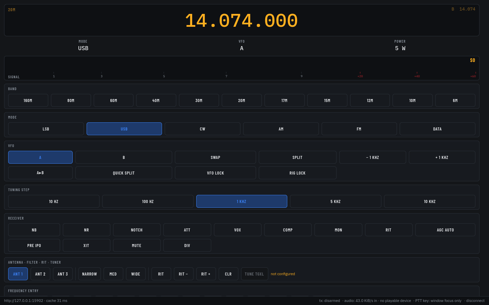

# HamDeck

Operate an HF station from another room, or another country. A small always-on
host sits at the radio doing CAT control and audio; a desktop client shows the
panel and keys the transmitter.



Built for and tested against a **Yaesu FTDX-101MP**. Other Yaesu CAT radios are
likely close, but nothing else has been on the air with it — see
[What is actually tested](#what-is-actually-tested).

## Download

Installers for every platform are on the
[latest release](https://github.com/jwussler/hamdeck-releases/releases/latest).

| | |
|---|---|
| **Windows** | **`HamDeck-Windows-Setup.exe`** — the radio panel plus the Wavelog pusher, updated together. **If you are not sure, this one.** |
| **Windows, panel only** | `HamDeck-Windows-PanelOnly-Setup.exe` — the same panel without the Wavelog pusher and without auto-update |
| **macOS** | `HamDeck-macOS.dmg` — signed, notarised and stapled; drag to Applications |
| **Linux** | `hamdeck-client_<version>_amd64.deb` / `_arm64.deb` |

Everything is code-signed. On Windows the publisher reads **Henry Wussler**;
SmartScreen may still warn, because it asks *"have I seen this file before?"*
rather than *"is this safe?"*, and a new release from a small publisher always
starts at no.

## How it fits together

```
  radio ──USB──┤ host ├── CAT + audio ──── HTTP / WebSocket ────┤ client │
   (CAT +      (any always-on Linux box;                     (Windows, macOS,
    USB audio)  a Raspberry Pi is the target)                      Linux)
```

**The host is the authority. The client is a display that asks.** Every limit
that matters lives at the radio, because a client can be closed, crashed, or run
from a laptop that goes to sleep mid-transmission:

- a **transmit watchdog** drops PTT after a timeout and confirms with the radio
  that it actually stopped
- **power returns to the local cap** when a remote client disconnects, so nobody
  walks up to a radio and drives an amplifier with twice the power they expect
- RX is **muted while you are keyed** — hearing your own voice back at ~220 ms is
  delayed auditory feedback, and it makes people slur and stutter

## What it does

- Full panel: twin VFO, band and mode, S-meter, filters, RIT/XIT, AGC,
  attenuator, preamp, noise blanker and reduction, antenna selection
- **Receive audio** streamed to the client, and **transmit audio** back to the rig
- **PTT** by hotkey or on-screen, with the watchdog above behind it
- **Recording** — continuous, plus a pre-trigger replay buffer that saves what
  happened *before* you pressed anything. Every recording writes a JSON sidecar
  with UTC times, frequency and mode, so it can be matched to a log later
- **Wavelog** integration on Windows: the log follows the radio
- A local REST API on loopback, so **Stream Deck** buttons work

## What is actually tested

Being straight about this, because a remote transmitter is not a good place for
optimism:

| | |
|---|---|
| Radio | Yaesu FTDX-101MP, over its USB CAT + audio codec |
| Host | Ubuntu 24.04, x86-64. ARM64 builds; a Pi is the intended home but has not run a station yet |
| Client | Windows x64, macOS (universal), Linux x64/ARM64 |
| Not implemented | CW keyer, voice memories, RX antenna switching — those buttons say so rather than failing silently |
| Not built | Windows on ARM native (x64 runs under emulation) |

## Building

```sh
# host (Linux)
cmake -S . -B build -DCMAKE_BUILD_TYPE=Release && cmake --build build

# client (Windows, macOS, Linux) — needs Qt 6.8+
cmake -S client -B client/build -DCMAKE_BUILD_TYPE=Release && cmake --build client/build
ctest --test-dir client/build
```

## Before you expose it

Read [SECURITY.md](SECURITY.md). The short version: the API port is meant for
**loopback**, the dashboard needs a session, and anything reachable from outside
your LAN belongs behind a tunnel or a reverse proxy that terminates TLS.

Remote operation does not change whose callsign is on the air. Control of the
transmitter, and the obligation to identify and stay in band, stay with the
operator.

## Licence

MIT — see [LICENSE](LICENSE). Qt is LGPL-3.0 and is linked dynamically, with its
licence text shipped alongside every binary.
